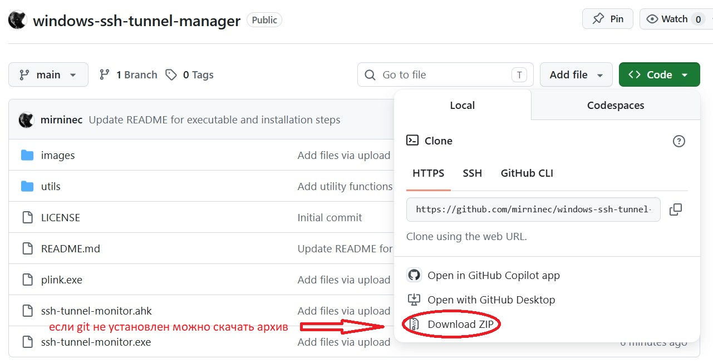
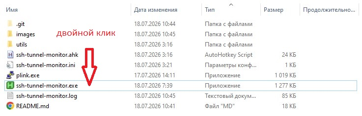
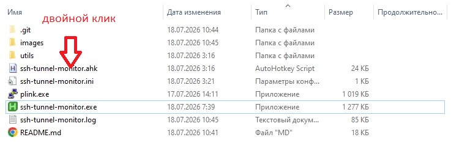
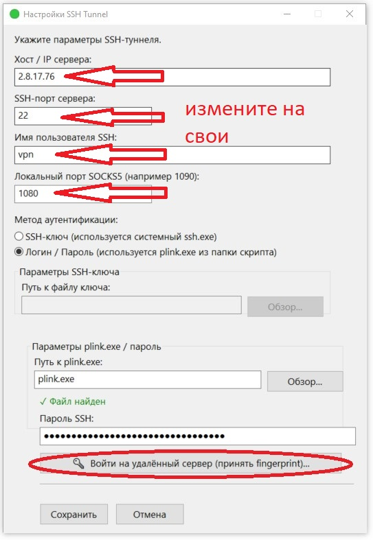
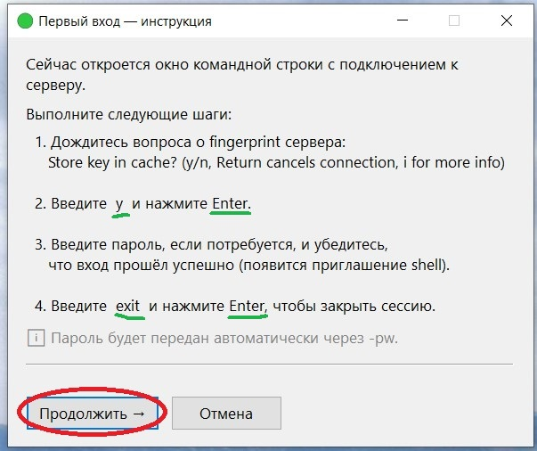
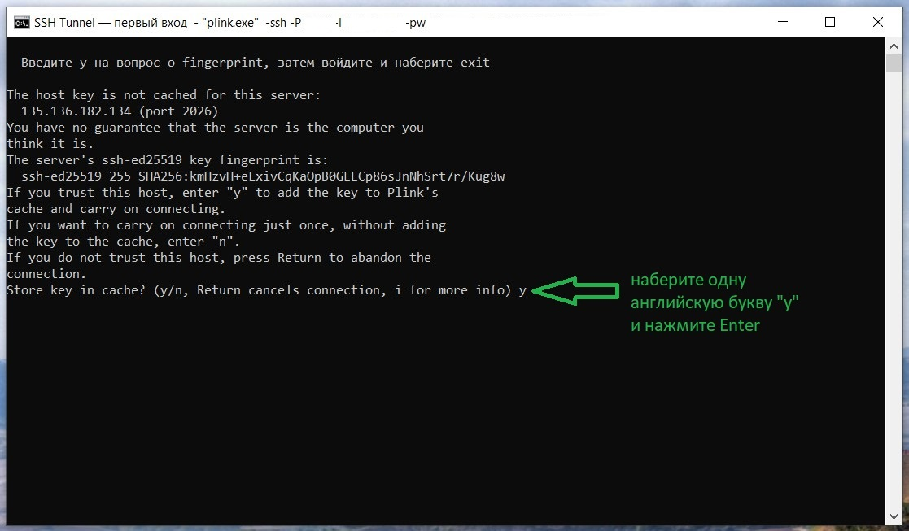
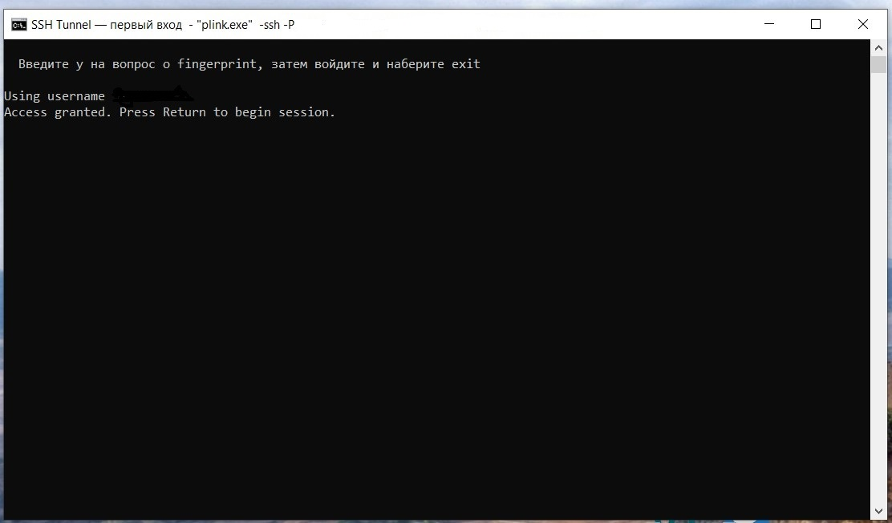
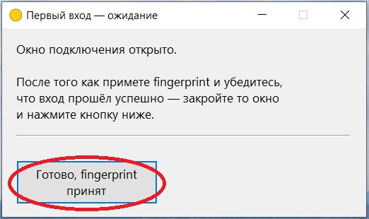
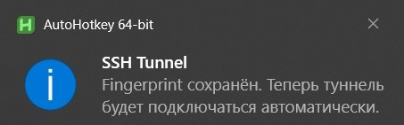

# 🚀 windows-ssh-tunnel-manager

**windows-ssh-tunnel-manager** — это AutoHotkey v2-скрипт для Windows, который автоматически создаёт, контролирует и восстанавливает SSH-туннель с локальным SOCKS5-прокси.

Скрипт работает в системном трее, следит за состоянием туннеля, перезапускает его при сбоях и предоставляет простой мастер настройки.

---

## 🛠 Что делает этот скрипт

Скрипт поднимает SSH-туннель вида:

```bash
ssh -D LOCAL_PORT user@server
```

или через `plink.exe`:

```bash
plink.exe -ssh -N -D LOCAL_PORT user@server
```

В результате на вашем компьютере появляется локальный SOCKS5-прокси, например:

```text
127.0.0.1:1080
```

Через этот SOCKS5-прокси можно направлять трафик браузера или других приложений.

**Скрипт умеет:**
- 🔌 создавать локальный SOCKS5-прокси через SSH;
- 🔑 подключаться по SSH-ключу через системный `ssh.exe`;
- 🔐 подключаться по логину и паролю через `plink.exe`;
- 🩺 автоматически проверять, жив ли туннель;
- 🔄 автоматически перезапускать туннель при обрыве;
- 🚥 показывать статус в системном трее;
- 📝 вести лог работы;
- 🛑 ограничивать количество неудачных попыток перезапуска;
- 🚀 запускаться вместе с Windows;
- 🪄 предоставлять удобный GUI-мастер первоначальной настройки.

---

## 🎯 Для кого это полезно

Этот проект может быть полезен, если вам нужно:

- 🛡️ постоянно держать SSH-туннель активным;
- 🌍 использовать удалённый сервер как SOCKS5-прокси;
- 🕵️ направлять трафик браузера через SSH;
- 🖱️ быстро включать прокси без ручного запуска командной строки;
- 📡 автоматически восстанавливать туннель после обрыва сети;
- 💻 использовать SSH-туннель на Windows без полноценного VPN;
- 👀 иметь простой трей-интерфейс для контроля состояния.

**Примеры сценариев:**
- доступ к внутренним ресурсам через SSH-сервер;
- безопасная работа через доверенный VPS/VDS;
- обход сетевых ограничений в рамках разрешённой инфраструктуры;
- постоянный SOCKS5-прокси для Firefox, Chrome, Edge или других приложений.

---

## ✨ Возможности

- 🪟 Windows tray-приложение на AutoHotkey v2
- 🐧 Поддержка OpenSSH `ssh.exe`
- 🖥️ Поддержка PuTTY `plink.exe`
- 🌐 SOCKS5-прокси через динамический SSH-туннель
- 🛡️ Аутентификация:
  - по SSH-ключу;
  - по логину и паролю.
- 🤖 Автоматический мониторинг состояния туннеля
- 🔄 Автоматический перезапуск при сбое
- 🔍 Проверка процесса по PID и локальному порту
- 🎨 Цветная иконка состояния:
  - 🟢 зелёная — туннель работает;
  - 🟡 жёлтая — проверка или перезапуск;
  - 🔴 красная — ошибка.
- 🗂️ Логирование с автоматической ротацией файлов
- ⚙️ Настройки в INI-файле
- 🏃‍♂️ Автозапуск при входе в Windows

---

## 📦 Требования

- 🪟 Windows 10 / Windows 11
- ⌨️ [AutoHotkey v2](https://www.autohotkey.com/)
- ☁️ Доступ к SSH-серверу

Также используется:
- Системный OpenSSH-клиент (`C:\Windows\System32\OpenSSH\ssh.exe`)
- `plink.exe` из пакета PuTTY.

> 💡 **Примечание:** В этом проекте `plink.exe` уже находится в папке со скриптами, поэтому отдельно скачивать его не нужно.

---

## 📁 Состав проекта

Пример структуры папки:

```text
windows-ssh-tunnel-manager/.
├── images
│   └── *.jpg
├── plink.exe
├── README.md
├── ssh-tunnel-monitor.exe      # готовая скомпилированная версия программы
├── ssh-tunnel-monitor.ahk      # главный скрипт
├── ssh-tunnel-monitor.ini      # создаётся после настройки
├── ssh-tunnel-monitor.log      # создаётся во время работы
└── utils
    ├── Logger.ahk
    ├── Tunnel.ahk
    └── Utils.ahk
```

---

## 📥 Установка



### Вариант 1. Использование готового `.exe` (рекомендуется)

Если вы не планируете изменять исходный код скрипта, устанавливать AutoHotkey **не нужно**.

1. Скачайте архив проекта с GitHub или клонируйте репозиторий:

```bash
git clone https://github.com/mirninec/windows-ssh-tunnel-manager.git
```

2. Перейдите в папку проекта.

3. Убедитесь, что рядом с программой находится файл `plink.exe`, если будете соединяться с удаленным сервером с помощью логина и пароля.

4. Дважды щёлкните по файлу `ssh-tunnel-monitor.exe`.


При первом запуске откроется мастер настройки.

---

### Вариант 2. Запуск исходного `.ahk`-скрипта

Этот вариант подходит, если вы хотите изучать или изменять исходный код.

#### 1. Установите AutoHotkey v2

Скачайте и установите AutoHotkey v2 с официального сайта:
👉 `https://www.autohotkey.com/` *(Важно: нужен именно v2, а не v1)*.

#### 2. Скачайте проект

Скачайте архив проекта с GitHub или клонируйте репозиторий:

```bash
git clone https://github.com/mirninec/windows-ssh-tunnel-manager.git
```

Перейдите в папку проекта.

#### 3. Проверьте наличие `plink.exe`

Убедитесь, что файл `plink.exe` находится рядом со скриптами, если будете соединяться с удаленным сервером с помощью логина и пароля.

#### 4. Запустите скрипт

Дважды щёлкните по файлу `ssh-tunnel-monitor.ahk`.

При первом запуске откроется мастер настройки.



---

## 🪄 Первоначальная настройка

При первом запуске скрипт попросит указать параметры SSH-туннеля.

| Поле | Описание |
|------|----------|
| **Хост / IP сервера** | Адрес SSH-сервера (например, `example.com`) |
| **SSH-порт сервера** | Обычно `22` |
| **Имя пользователя SSH** | Ваш логин на удалённом сервере |
| **Локальный порт SOCKS5** | Свободный порт на ПК (например, `1080` или `1090`) |

---

## 🔑 Режимы аутентификации

### 🗝️ Вариант 1. SSH-ключ (рекомендуется)
Использует системный клиент `ssh.exe`.
В мастере настройки выберите: `SSH-ключ (используется системный ssh.exe)`.
Можно указать путь к приватному ключу (например, `C:\Users\User\.ssh\id_ed25519`). Если путь не указан, используются ключи из `~/.ssh` или SSH-agent.

### 🔐 Вариант 2. Логин / пароль
Использует `plink.exe`, который находится в папке со скриптом.
В мастере настройки выберите: `Логин / Пароль (используется plink.exe из папки скрипта)`. Укажите пароль.

---

## 🤝 Первый вход через `plink.exe`

Если вы выбрали **Логин / Пароль**, `plink.exe` должен один раз сохранить fingerprint (отпечаток) SSH-сервера.

1. В мастере настройки нажмите кнопку: `🔑 Войти на удалённый сервер (принять fingerprint)...` 
2. Появится окно с инструкцией. Прочитайте и нажмите "Продолжить". 
3. Откроется командная строка. При появлении вопроса о fingerprint введите `y` и нажмите `Enter`. 
4. При необходимости введите пароль.
5. Выполните команду `exit`.
6. Если окно будет иметь такой вид:  значит отпечаток (fingerprint) уже находится в реестре Windows. Просто закройте окно.
7. Вернитесь в мастер настройки и подтвердите действие. 
8. Появится сообщение



Ничего делать не надо. Сообщение скоро закроется.

После этого автоматическое подключение будет работать без вопросов.

---

## 🖱️ Использование (Меню в трее)

После запуска скрипт появляется в системном трее (возле часов). Правый клик по иконке открывает меню:

| Пункт меню | Назначение |
|-----------|------------|
| 🩺 **Проверить / восстановить** | Немедленно проверить состояние и восстановить при необходимости |
| 🔄 **Перезапустить туннель** | Принудительно остановить и снова запустить туннель |
| ℹ️ **Статус** | Показать текущее состояние туннеля (PID, порты, ошибки) |
| ⚙️ **Настройки** | Открыть мастер настройки |
| 📄 **Открыть лог** | Открыть лог-файл в Блокноте |
| 🚀 **Запускать при входе...** | Включить/отключить автозапуск вместе с Windows |
| ❌ **Выход** | Остановить туннель и закрыть скрипт |

---

## 🎨 Цвета иконки в трее

- 🟢 **Зелёный** — туннель активен, процесс жив, порт слушается.
- 🟡 **Жёлтый** — идёт проверка, запуск или восстановление туннеля.
- 🔴 **Красный** — туннель не работает (ошибка авторизации, порт занят и т.д.).

---

## 🔍 Проверка работы

Чтобы убедиться, что порт слушается, откройте PowerShell и введите:
```powershell
Get-NetTCPConnection -State Listen -LocalPort 1080
```
*(Замените 1080 на ваш порт)*. Если туннель работает, команда покажет активное прослушивание.

---

## 📝 Логи

Скрипт ведёт подробный лог работы в файле `ssh-tunnel-monitor.log`.
Поддерживается автоматическая ротация: при достижении лимита в 1 МБ старый лог переименовывается в `.log.1`, `.log.2` и т.д.

---

# 🌐 Подключение SOCKS5-прокси в браузерах

После успешного запуска у вас появляется локальный SOCKS5-прокси (например, `127.0.0.1:1080`). Вот как направить через него браузер.

### 🦊 Firefox (Самый удобный вариант)
Firefox позволяет задать прокси только для самого браузера, не трогая систему.
1. Настройки → Основные → Параметры сети → **Настроить...**
2. Выберите **Ручная настройка прокси**.
3. SOCKS-хост: `127.0.0.1`, Порт: `1080`.
4. Версия: **SOCKS v5**.
5. ✅ Обязательно поставьте галочку **Проксировать DNS при использовании SOCKS v5**.
6. Нажмите OK.

### 🌍 Google Chrome / 🌊 Microsoft Edge / 🦁 Brave / 🔴 Яндекс Браузер
#### Используйте  (рекомендую для Chromium-like браузеров)
Это расширение для Chromium-like браузеров, позволяющее в пару кликов настроить работу браузера через SOCKS5-прокси с гибким списком исключений (bypass list).
#### Запуск браузеров из консоли с аргументами командной строки.
Эти браузеры используют системные настройки Windows. Чтобы пустить через прокси *только браузер*, запустите его с параметром командной строки:

```cmd
chrome.exe --proxy-server="socks5://127.0.0.1:1080" --host-resolver-rules="MAP * ~NOTFOUND , EXCLUDE 127.0.0.1"
```
*(Параметр `--host-resolver-rules` нужен, чтобы DNS-запросы также шли через туннель).*

Для удобства можно создать отдельный ярлык браузера на рабочем столе и дописать эти параметры в поле "Объект" (Target). Также можно использовать популярные расширения вроде **SwitchyOmega** или **Proxy SwitchySharp**.

---

## 🕵️ Проверка IP в браузере

Откройте любой сервис проверки IP, например:
- 🔗 `https://ifconfig.me/`
- 🔗 `https://2ip.ru/`

Если всё настроено правильно, сайт покажет IP-адрес вашего удалённого SSH-сервера.

---

## ❓ Частые проблемы

- 🔴 **Красная иконка в трее:** Неверный хост/порт, неправильный пароль, не найден ключ, или локальный порт (`1080`) уже занят другой программой. Откройте `Статус` или `Лог` для проверки.
- 🛑 **Порт уже занят:** Измените локальный порт в настройках на другой (например, `1081` или `1090`).
- ⚠️ **Туннель не запускается через plink:** Вы забыли принять fingerprint. Зайдите в Настройки и нажмите кнопку "Войти на удалённый сервер".
- 🌐 **Сайты не открываются в браузере:** Проверьте, включили ли вы "Проксировать DNS" (в Firefox) или добавили ли правила DNS для Chrome.

---

## 🔒 Безопасность

⚠️ **Внимание:** Если используется режим `Логин / Пароль`, ваш пароль сохраняется в открытом виде в конфигурационном файле `ssh-tunnel-monitor.ini`.
- Храните папку со скриптом в безопасном месте.
- Никому не передавайте файл `.ini`.
- По возможности используйте **SSH-ключи** вместо паролей — это намного безопаснее.

---

## 📄 Лицензия

Этот проект распространяется под лицензией MIT. Вы можете свободно использовать, изменять и распространять его.

---

## ⚡ Краткий пример использования

1. Запустить `ssh-tunnel-monitor.exe` (или `ssh-tunnel-monitor.ahk`).
2. Указать: `user@example.com`, порт `22`, локальный порт `1080`.
3. Выбрать SSH-ключ (или ввести пароль).
4. Нажать "Сохранить".
5. Дождаться 🟢 зелёной иконки в трее.
6. Настроить браузер на SOCKS5 `127.0.0.1:1080`.
7. 🎉 Пользоваться безопасным интернетом!
